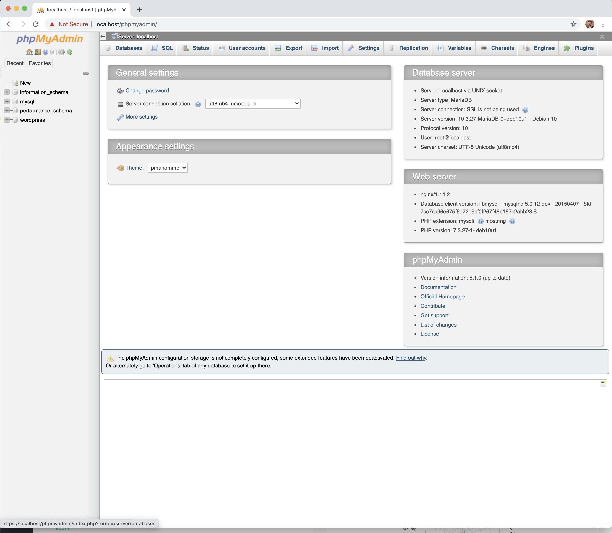

### This is a complete step-by-step tutorial to validate ft_server project (s42 network)

--------------------------------------------------------------------------------------------------------------------------------------
# Prerequisites:
### - 📚 You know all the concepts needed for this project: containers, images, ports etc.
### - 🐳 You have Docker installed and it is running ([**download link**](https://www.docker.com/get-started))

--------------------------------------------------------------------------------------------------------------------------------------
# Building, running and cleaning up your containers:
You will often need to test your work. The following commands are used *A LOT* and I recommend to create a Makefile with rules that will execute them for you to make your life easier ([example](./Makefile))

`docker build -t ft_server .` will **_🛠️ build_** our Docker container and name it "ft_server". 

`docker run -it --rm -p 80:80 -p 443:443 ft_server` After it's built this command will  **_🏃‍♂️ run_** our container and:
  * `-it` open its terminal and allow us to execute commands inside (useful to manually check the contents of the container)
  * `--rm` automatically remove the container once it's stopped
  * `-p` link the necessary ports between the container and our computer (80 and 443)
  * And finally, name it "ft_server"
 
`docker rmi $(docker images -q)` will remove all the images

`docker rm $(docker ps -qa)` will remove all the containers

`docker system prune` will cleanup the temporary files and the rest of remaining used space

--------------------------------------------------------------------------------------------------------------------------------------
# Project parts summary:
#### 1) [Create a Dockerfile and download a Debian Buster image](#create-a-dockerfile-and-download-a-debian-buster-image)
#### 2) [Install all of the dependencies](#install-all-of-the-dependencies)
#### 3) [Install and configure NGINX](#install-and-configure-nginx)
#### 4) [Install and configure phpMyAdmin](#install-and-configure-phpmyadmin)
#### 5) [Install and configure Wordpress](#install-and-configure-wordpress)
#### 6) [Generate SSL certificate and key](#generate-ssl-certificate-and-key)
#### 7) [Autoindex and wrapping up](#autoindex-and-wrapping-up)

--------------------------------------------------------------------------------------------------------------------------------------
# Create a Dockerfile and download a Debian Buster image
All you need to do is:
* Create a file named Dockerfile
* Add a line `FROM debian:buster` inside.
* Add lines `RUN apt-get update` and `RUN apt-get upgrade -y`
<br />

Dockerfile is like a Makefile, but instead of executing commands in your terminal it will do it inside Docker images.

The command `FROM` tells Docker to download the image that follows and use the commands we'll add in the next step inside this image.

Here we are using an empty Debian Buster operating system image as asked in the subject.

You can imagine that we download an empty Windows or MacOS now and in the next step we will start installing the dependencies needed for the rest of our project.

Before we do that, we need to update the Debian Buster packages to make sure everything is up to date just as we need.

This is simply done by adding `RUN apt-get update` and `RUN apt-get upgrade -y` to our Dockerfile. 

`RUN` is used in Dockerfile to execute the command inside the image, as if it is entered in the terminal of our Debian OS.

<br />

```Dockerfile
#------------------ 1. Create a Dockerfile and download Debian Buster image ----------------------
# Download debian:buster from Docker and use it as main image here
FROM debian:buster

# Update Debian Buster packages
RUN apt-get update
RUN apt-get upgrade -y
#-------------------------------------------------------------------------------------------------
```
Now if we try to build our docker image and run it, Debian Buster image will be downloaded from Docker and it will be updated.


--------------------------------------------------------------------------------------------------------------------------------------
# Install all of the dependencies
Now that we have our Dockerfile and an empty Debian OS with basic packages, we will install the dependencies and tools needed for further steps in the project.

This is done by adding several `apt-get install` to our Dockerfile.

For this project there is a couple of things we need:

```Dockerfile
#----------------------------------- 2. Intall Dependencies --------------------------------------
# Sysvinit-utils for "service" command used to easily start and restart out nginx
RUN apt-get install sysvinit-utils

# Wget is used to easily download phpMyAdmin / Wordpress
RUN apt-get -y install wget

# Nginx is an open source web server tool we are going to use to connect our Docker container image to our webpage
RUN apt-get -y install nginx

# MariaDB is a tool used to manage databases. It's a community "fork" of MySQL (= improved version of MySQL)
RUN apt-get -y install mariadb-server

# Php packages are needed to read our configuration files and properly connect all of our components together
# In case a php package is missing, we will get an error when launching php related services later
RUN apt-get -y install php-cgi php-common php-fpm php-pear php-mbstring
RUN apt-get -y install php-zip php-net-socket php-gd php-xml-util php-gettext php-mysql php-bcmath
#-------------------------------------------------------------------------------------------------
```
Now if we try to build our docker image and run it, it downloads/updates Debian Buster and downloads all the dependencies we need.


--------------------------------------------------------------------------------------------------------------------------------------

# Install and configure NGINX
In the previous part of the project we have downloaded nginx using `RUN apt-get -y install nginx`.

Now, we will configure it to connect our container to our webpage.

In order to do so, NGINX will need a configuration file where we will tell it what is our webpage name, what ports he needs to "listen" to and what other tools we will use.

Normally on our computer we would simply create a file and write inside, but since we need to do it inside the container, we prepare the configuration file in advance and then copy it inside our container when we need it.

In our project folder, let's create a "srcs" folder as required by subject and create an empty file named "localhost" inside.

localhost is the webpage we will be using to acces our web server in this project.

Add the following lines to our "[**localhost**](./srcs/localhost)" file:
```php
server {
     # tells to listen to port 80
     listen 80;
     # same but for IPV6
     listen [::]:80;
     # tells the name(s) of our website
     server_name localhost www.localhost;
     # will redirect us to https://$host$request_uri;
     # when we try to reach the website name in our browser
     return 301 https://$host$request_uri;
 }
 server {
    # tells to listen to port 443
    listen 443 ssl;
    # same but for IPV6
    listen [::]:443 ssl;
    # tells the name(s) of our website
    server_name localhost www.localhost;

    # Enables SSL protocol
    ssl on;
    # Tells where to look for SSL certificate
    ssl_certificate /etc/ssl/nginx-selfsigned.crt;
    # Tells where to look for SSL key
    ssl_certificate_key /etc/ssl/nginx-selfsigned.key;

    # Tells where to look for all the files related to our website
    root /var/www/localhost;
    # Enables autoindex to redirect us to the choice between wordpress and phpMyAdmin
    autoindex on;
    # Tells the possible names of the index file
    index index.html index.htm index.php;
    # Tells to check for existence of files before moving on
	location / {
		try_files $uri $uri/ =404;
	}
    # Specifies the php configuration
	location ~ \.php$ {
		include snippets/fastcgi-php.conf;
		fastcgi_pass unix:/run/php/php7.3-fpm.sock;
	}
 }
 ```
 At this point we have added inside everything we need for the entire project, but some parts aren't functionnal yet and will be added further in this guide.
 
 Now that our configuration is ready, we will need to add some lines to our Dockerfile to copy it inside the container and set it up:
 ```Dockerfile
#----------------------------------- 3. Install and configure Nginx  ------------------------------
# NGINX will need a folder where it will search for everything related to our website
RUN mkdir /var/www/localhost

# COPY copies files from the given directory on our computer to given directory inside our container.
# If a file already exists in the specified directory, it will overwrite it
# We place it inside /etc/nginx/sites-available as required per NGINX documentation
COPY srcs/localhost /etc/nginx/sites-available

# We also need to create a link between the 2 following folder to "enable" our website
RUN ln -s /etc/nginx/sites-available/localhost /etc/nginx/sites-enabled

# For the next steps, we will be working inside /var/www/localhost directory
# To avoid writing /var/www/localhost before every command, we can change current working directory
# WORKDIR command in dockerfile changes the directory where next commands will be executed
WORKDIR /var/www/localhost/
#-------------------------------------------------------------------------------------------------
```
Now if we try to build our docker image and run it, it downloads/updates Debian Buster, all of the dependencies we need
and also copies our NGINX configuration file named "[**localhost**](./srcs/localhost)" inside the container.

We still have no way of reaching our website and checking that everything works, this will be added in the last step.

--------------------------------------------------------------------------------------------------------------------------------------

# Install and configure phpMyAdmin
In step 2 we have installed mariadb-server. Now we will configure it and set up phpMyAdmin to use it.

[**Here (step 2)**](https://www.digitalocean.com/community/tutorials/how-to-install-linux-nginx-mariadb-php-lemp-stack-on-debian-10) you can see how to install, launch and setup mariadb databases by running several commands inside Debian Buster terminal. 

For our project we need to tell our container to execute these commands automatically, without us typing them ourselves. 

This can be achieved by creating a ".sh" file that we will launch when running our container. 

In our "srcs" folder, let's create a "[start.sh](./srcs/start.sh)" file and try to configure mariadb and create a database we can later use for Wordpress by adding the following commands inside:
```Shell
# Start up NGINX
service nginx start;

# Start up MySQL
service mysql start;

# Start up PHP
service php7.3-fpm start;

#------------------------ Create & configure Wordpress database ----------------------------------------

# 1. Connect to MySQL using "root" account and create a database named "wordpress"
echo "CREATE DATABASE wordpress;" | mysql -u root --skip-password;

# 2. Gives the user "root" all possible rights related to "wordpress" database
echo "GRANT ALL PRIVILEGES ON wordpress.* TO 'root'@'localhost' WITH GRANT OPTION;" | mysql -u root --skip-password;

# 3. Apply the previous changes (otherwise it waits until we restart the server)
echo "FLUSH PRIVILEGES;" | mysql -u root --skip-password;

# 4. Disregards the password, check the UNIX socker instead
# Since we setup no password, it wouldn't let us connect to phpMyAdmin otherwise
echo "update mysql.user set plugin='' where user='root';" | mysql -u root --skip-password;

#------------------------------------------------------------------------------------------------------
# Restart the nginx to apply the changes
service nginx restart;

# Restart php to apply the changes
service php7.3-fpm restart;

# At this point the commands will be executed once and that's it, we need to be able to keep our server
# running. There are multiple ways to achieve this, but here I will use a kind of a lazy solution of
# executing "sleep infinity" command which will simply keep our server running until we press CTRL+C
sleep infinity

# Please note that since "sleep infinity" is executed while running our container,
# the "docker run" flags "-it" (= terminal mode with a "pretty" format) are not going to do anything anymore.
# If you still want to run your container in terminal mode, you can remove the "sleep infinity" command
```

Now that all of the commands we need to execute are ready and waiting in "[start.sh](./srcs/start.sh)" file, let's place it in our
container and tell our Dockerfile to execute it.

```Dockerfile
#----------------------------------- 4. PHP MY ADMIN ---------------------------------------------
# Move start.sh from our computer inside the container
COPY ./srcs/start.sh ./

# Every other command in Dockerfile is executed while "building" our container
# CMD tells Docker the default command to execute when we are "running" our container
CMD bash start.sh;
```

Now that we are managing databases with MariaDB and we have created a database, let's download and configure phpMyAdmin to test it! 

First, just as for NGINX, phpMyAdmin will need a configuration file to set up some basic behaviour.

Let's create a "[config.inc.php](./srcs/config.inc.php)" file in our "srcs" folder and add the following lines inside:

```PHP
<?php
/**
 * phpMyAdmin sample configuration, you can use it as base for
 * manual configuration. For easier setup you can use setup/
 *
 * All directives are explained in documentation in the doc/ folder
 * or at <https://docs.phpmyadmin.net/>.
 */

declare(strict_types=1);

/**
 * This is needed for cookie based authentication to encrypt password in
 * cookie. Needs to be 32 chars long.
 */
$cfg['blowfish_secret'] = 'abcdefghijklmnopqrstuvwxyz0123456789'; /* YOU MUST FILL IN THIS FOR COOKIE AUTH! */

/**
 * Servers configuration
 */
$i = 0;

/**
 * First server
 */
$i++;
/* Authentication type */
$cfg['Servers'][$i]['auth_type'] = 'cookie';
/* Server parameters */
$cfg['Servers'][$i]['host'] = 'localhost';
$cfg['Servers'][$i]['compress'] = false;
/* This is needed to login to phpMyAdmin without the use of the password */
$cfg['Servers'][$i]['AllowNoPassword'] = true;

/**
 * Directories for saving/loading files from server
 */
$cfg['UploadDir'] = '';
$cfg['SaveDir'] = '';
```

Now that we have our phpMyAdmin configuration file ready, let's download phpMyAdmin and set everything up!

Add the following lines to our Dockerfile:

```Dockerfile
# Download phpMyAdmin by using "wget" which we installed in step 2
RUN wget https://files.phpmyadmin.net/phpMyAdmin/5.1.0/phpMyAdmin-5.1.0-english.tar.gz

# Extract the downloaded compressed files and remove the ".tar" file we no longer need
RUN tar -xf phpMyAdmin-5.1.0-english.tar.gz && rm -rf phpMyAdmin-5.1.0-english.tar.gz

# Move the extracted files in the "phpmyadmin" folder
RUN mv phpMyAdmin-5.1.0-english phpmyadmin

# Copy the "config.inc.php" file we created to the same "phpmyadmin" folder
COPY ./srcs/config.inc.php phpmyadmin
#-------------------------------------------------------------------------------------------------
```

Now if we try to build our docker image and run it, it downloads/updates Debian Buster, all of the dependencies we need
and also copies our NGINX configuration file inside the container.

It also copies our "[start.sh](./srcs/start.sh)" file inside the container which will be executed when we run our container to create a database and a profile to access and use phpMyAdmin.

Afterwards, it downloads and installs phpMyAdmin, and copies phpMyAdmin configuration file "[config.inc.php](./srcs/config.inc.php)" inside our container.

# Install and configure Wordpress
In step 4 we have already prepared a database for Wordpress.

Now we will create a configuration file for Wordpress, download it using "wget" and set it up.

Let's start by creating a configuration file named "[wp-config.php](./srcs/wp-config.php)" in our "srcs" folder.

Add the following lines inside:
```php
<?php

// ** MySQL settings - You can get this info from your web host ** //
/** The name of the database for WordPress */
define( 'DB_NAME', 'wordpress' );

/** MySQL database username */
define( 'DB_USER', 'root' );

/** MySQL database password */
define( 'DB_PASSWORD', '' );

/** MySQL hostname */
define( 'DB_HOST', 'localhost' );

/** Database Charset to use in creating database tables. */
define( 'DB_CHARSET', 'utf8' );

/** The Database Collate type. Don't change this if in doubt. */
define( 'DB_COLLATE', '' );

/**#@+
 * Authentication Unique Keys and Salts.
 *
 * Change these to different unique phrases!
 * You can generate these using the {@link https://api.wordpress.org/secret-key/1.1/salt/ WordPress.org secret-key service}
 * You can change these at any point in time to invalidate all existing cookies. This will force all users to have to log in again.
 *
 * @since 2.6.0
 */
define( 'AUTH_KEY',         'put your unique phrase here' );
define( 'SECURE_AUTH_KEY',  'put your unique phrase here' );
define( 'LOGGED_IN_KEY',    'put your unique phrase here' );
define( 'NONCE_KEY',        'put your unique phrase here' );
define( 'AUTH_SALT',        'put your unique phrase here' );
define( 'SECURE_AUTH_SALT', 'put your unique phrase here' );
define( 'LOGGED_IN_SALT',   'put your unique phrase here' );
define( 'NONCE_SALT',       'put your unique phrase here' );

/**#@-*/

/**
 * WordPress Database Table prefix.
 *
 * You can have multiple installations in one database if you give each
 * a unique prefix. Only numbers, letters, and underscores please!
 */
$table_prefix = 'wp_';

/**
 * For developers: WordPress debugging mode.
 *
 * Change this to true to enable the display of notices during development.
 * It is strongly recommended that plugin and theme developers use WP_DEBUG
 * in their development environments.
 *
 * For information on other constants that can be used for debugging,
 * visit the Codex.
 *
 * @link https://codex.wordpress.org/Debugging_in_WordPress
 */
define( 'WP_DEBUG', false );

/* That's all, stop editing! Happy publishing. */

/** Absolute path to the WordPress directory. */
if ( ! defined( 'ABSPATH' ) ) {
	define( 'ABSPATH', dirname( __FILE__ ) . '/' );
}

/** Sets up WordPress vars and included files. */
require_once( ABSPATH . 'wp-settings.php' );
```

Now that we have our configuration file ready, let's download Wordpress and configure our container!

Add the following lines in our Dockerfile:

```Dockerfile
#----------------------------- 5.Install and configure Wordpress ---------------------------------
# Download Wordpress using wget
RUN wget https://wordpress.org/latest.tar.gz

# Extract it and remove the .tar file
RUN tar -xvzf latest.tar.gz && rm -rf latest.tar.gz 

# Copy our configuration file inside the container
COPY ./srcs/wp-config.php /var/www/localhost/wordpress

# Change ownership and allow access to all the files
# This is required for phpMyAdmin to have acces to all the data, otherwise it will display an error
RUN chown -R www-data:www-data *
RUN chmod -R 755 /var/www/*
#-------------------------------------------------------------------------------------------------
```
That's it! Now we have our debian buster image, all the dependencies we need, NGINX, phpMyAdmin and Wordpress configued. The only thing left to do is setup the SSL protocol and the project is ready!

--------------------------------------------------------------------------------------------------------------------------------------
# Generate SSL certificate and key
In step 3 we have added a "[localhost](./srcs/localhost)" file in our "srcs" folder which was telling NGINX where to look for the ssl certificate and key.

Now we will create those by adding a simple (but a very long) line in our [Dockerfile](./Dockerfile):
```Dockerfile
#----------------------------- 6. Generate SSL certificate and key -------------------------------
# SSL creates a secured channel between the web browser and the web server
#
# "openssl" command allows us to create a certificate and key ourselves
# here below is the explanation of the flags used:
# -x509 specifies a self signed certificate
# -nodes specifies that the private key wont be encrypted
# -days specifies the validity (in days) of the certificate
# -subj allows us to use the following string (and not create a separate file for it)
# The next line is personnal information, you will need to use your own
# -newkey creates a new certificate request and a new private key 
# -rsa 2018 is the standard key size (in bits)
# -keyout specifies where to save the key
# -out specifies the file name
RUN openssl req -x509 -nodes -days 30 -subj "/C=BE/ST=Belgium/L=Brussels/O=42 Network/OU=s19/CN=ysoroko" -newkey rsa:2048 -keyout /etc/ssl/nginx-selfsigned.key -out /etc/ssl/nginx-selfsigned.crt;
#-------------------------------------------------------------------------------------------------
```
And this is it!

Now we have a fully functional ft_server project with NGINX, MySQL (MariaDB), phpMyAdmin, Wordpress and SSL protocol!

You can try to build and run your container and then try to open [**localhost**](https://localhost/) webpage.

You will see a message of the kind:


You can then simply click on "Advanced" button and then click on "Proceed to localhost (unsafe)" to reach the index homepage of our project.

Since we created an auto-signed ssl certificate and key we get the warning "Your connection is not private".

However, the ssl protocol is up and running.

You can see that the website is using our certificate and key by clicking "Not Secure" -> Certificate (on Google Chrome) to see all the details we entered before in openssl command.

Since we are not a verified party who can issue SSL certificates, we are unfortunately not trustworthy 😢.

Another sign that we are using ssl is that we are using "https://" and not "http://" to reach the webpage.

--------------------------------------------------------------------------------------------------------------------------------------
# Autoindex and wrapping up

#### Autoindex
Normally when your build and run the container now and while it is running you try to reach [**localhost**](https://localhost/) webpage, you will see the contents of your /var/www/localhost/ directory:


If you click on Wordpress, you will open Wordpress service and the same goes for phpMyAdmin.


This "homepage" with all of your contents is displayed because autoindex is activated in our "[localhost](./srcs/localhost)" configuration file:

```php
# Enables autoindex to redirect us to the choice between wordpress and phpMyAdmin
autoindex on;
```
To deactivate it, you can replace "on" by "off", then rebuild and rerun the container.

This will show you an "403 Forbidden" error while opening [**localhost**](https://localhost/), but Wordpress and phpMyAdmin are
still accessible by their addresses [**https://localhost/phpmyadmin/**](https://localhost/phpmyadmin/) and [**https://localhost/wordpress/**](https://localhost/phpmyadmin/)

#### Wrapping up
You can now open Wordpress by clicking on it on autoindex homepage or reaching [**https://localhost/wordpress/**](https://localhost/phpmyadmin/).

The first time, it will ask you to create a profile and afterwards you will be able to login with it and use all of the Wordpress features like themes, posts etc.


Afterwards, you can login into phpMyAdmin by using "root" username and an empty password (this was setup in our "[start.sh](./srcs/start.sh)" file and we can create an empty password because we allowed it in "[config.inc.php](./srcs/config.inc.php)" file). 

While in phpMyAdmin you will be able to check out the Wordpress database and the changes like newly created users/posts etc. 

If you didn't open and setup Wordpress before you got to phpMyAdmin, the "Wordpress" section is going to be empty.




You can check that the profile you created to access Wordpress is actually appearing in phpMyAdmin tables in "wordpress" -> "wp-users" section to make sure the link between the two is working properly.

--------------------------------------------------------------------------------------------------------------------------------------

# Error checking
#### In case you complete this tutorial and you get any errors, you can find final versions of each file in this repository to compare them with yours.
#### Please avoid simply copy/pasting everything as there are a lot of handy new concepts you need to understand and use in a later project "ft_services".
* [Dockerfile](./Dockerfile)
* [localhost](./srcs/localhost)
* [start.sh](./srcs/start.sh)
* [config.inc.php](./srcs/config.inc.php)
* [wp-config.php](./srcs/wp-config.php)
* (Optional but helpful: [Makefile](./Makefile))

--------------------------------------------------------------------------------------------------------------------------------------

# Useful links:
- [**Udemy course as a useful introduction to Docker**](https://www.udemy.com/course/docker-and-kubernetes-the-complete-guide/)
- [**How to install LEMP stack on Debian 10**](https://www.digitalocean.com/community/tutorials/how-to-install-linux-nginx-mariadb-php-lemp-stack-on-debian-10)
- [**Wordpress and phpMyAdmin setup with Docker on Alpine**](https://codingwithmanny.medium.com/custom-wordpress-docker-setup-8851e98e6b8)
- [**Generating a self signed SSL key**](https://linuxize.com/post/creating-a-self-signed-ssl-certificate/)
- [**Incomplete project guide by a 42 student (part 1)**](https://forhjy.medium.com/how-to-install-lemp-wordpress-on-debian-buster-by-using-dockerfile-1-75ddf3ede861)
- [**Incomplete project guide by a 42 student (part 2)**](https://forhjy.medium.com/42-ft-server-how-to-install-lemp-wordpress-on-debian-buster-by-using-dockerfile-2-4042adb2ab2c)

--------------------------------------------------------------------------------------------------------------------------------------
